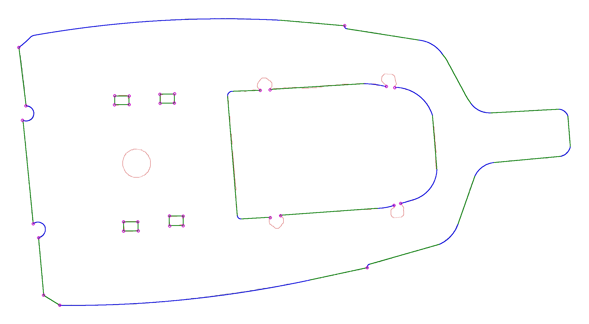

# Calibration findings — Key West, drawing #1 (2026-08-30)

Source: `outputs/runs/21kwcockpit-20260830-150126/outline.3dm` (USER_CAM::PANEL_1 + USER_CORNERS),
analysed with the loose pass (5 mm snap; snap was off in Rhino, console left unfinished).
Data: `keywest_1_calibration.json`, picture: `keywest_1_drawing.png` (grey = RAW outer,
red = RAW obstacles, green = drawn lines, blue = drawn arcs, magenta = corner markers).

## What was drawn

| chain | closed | reference | primitives | length | per m | joins |
|---|---|---|---|---:|---:|---|
| outer deck | yes | RAW outer | 31 (16 L / 15 A) | 10.98 m | **2.8** | 9 marked corners, 2 tangent, 9 near-tangent, 11 unmarked corners |
| feet ×4 | yes | RAW obstacles 3–6 | 4 lines each | 0.34 m each | 11.7 | 4 marked corners each |
| console | no (4 open chains) | RAW obstacle 1 | 13 (6 L / 7 A) so far | 4.3 m | ~3 | unfinished |

For comparison, v1's automatic fitter produced **154 primitives** for the same outer deck (14 per metre).

## Outer deck, in numbers

- **Lines:** 16, lengths 14–763 mm; the three shortest (14, 45, 53 mm) are connectors at the rod-holder notches, the rest 138–763 mm.
- **Arcs:** 15, in three clear families:
  - fillets **R 19–94 mm** (sweeps 34–207°) at notch ends and stern corners;
  - transitions **R 168–253 mm** (46–57°) where a side meets the transom;
  - the gently curved bow sides: **R 8052 and 8475 mm, 1.8 m long each, 13° sweep** — one primitive per side, not a chain of arcs.
- **Deviation from RAW** (signed, + = into deck, − = beyond wall): median **−0.08 mm** (drawn through the middle of the noise band, not offset to the safe side), |dev| p95 **3.4 mm**, mean 1.35 mm; wall-side penetration p95 3.9 mm, max **6.4 mm** at isolated raw spikes, which the drawing ignores.
- **Joins:** 9 marked corners; 2 exactly tangent; 9 near-tangent at **1.4–3.3°** (tangent intent, imprecise because snap/tangent tools were off); 11 unmarked joins of 5–17° — mostly 5–9° where a line meets a very large-radius arc (treated as tangent intent), two at 16–17° that are probably real corners without a marker.

## Obstacles

- **Feet:** four 106 × 63 mm rectangles with sharp corners, drawn 2–10 mm *outside* the raw contour (clearance), matched to raw obstacles 3–6 automatically.
- **Console:** straight sides with sharp corners, a large arc across the aft end, the four cleat "ears" cut around with short segments and corners; not finished (closing gaps 20–70 mm).
- The round drain/hatch on the raw layer was not drawn (left for later).

## Rules the drawing implies for the Phase 2 fitter

1. **Corner-first.** Find true corners before fitting anything: a direction change of roughly ≥ 15–20° concentrated in a short arc length. Every rectangle corner, notch end and console corner is a sharp, explicit corner — never a fillet.
2. **One primitive per regime.** Between corners, fit the *longest* single LINE or ARC that stays within a band of about **±3.5 mm (p95)** around the robust reference, tolerating isolated spikes to about **6 mm** when they are narrow (a few tens of mm). Centre on the reference; do not bias to the safe side.
3. **Lines before arcs.** A LINE is used whenever it fits the band (16 of 31); an ARC only when the line residual exceeds it. Radius is unbounded upward — 8 m arcs are correct for a nearly straight side.
4. **Tangent transitions where the shape is round.** Line-to-arc and arc-to-arc joins that are not corners are tangent by intent; the software makes them exactly tangent (0.10° limit), the hand only has to be close.
5. **Small obstacles are drawn faithfully, not smoothed:** rectangles with sharp corners and a few mm of clearance; semicircular notches as one arc between two corners.
6. **Expected density:** about 3 primitives per metre on the deck perimeter; up to ~12 per metre on small cut-outs. 154 primitives on this deck is wrong by a factor of five.

## Drawing tips for the next boat

- Turn **Osnap → End** on so joins snap (strict ingest needs ≤ 0.5 mm; the loose pass tolerates 5 mm).
- Use the **Arc: tangent to curve** tool for tangent transitions; then near-tangent joins become exact.
- Drop a **Point on USER_CORNERS** at every intentional corner, including the 16–17° ones.
- Close every loop; ingest reports the closing gap of anything still open.
